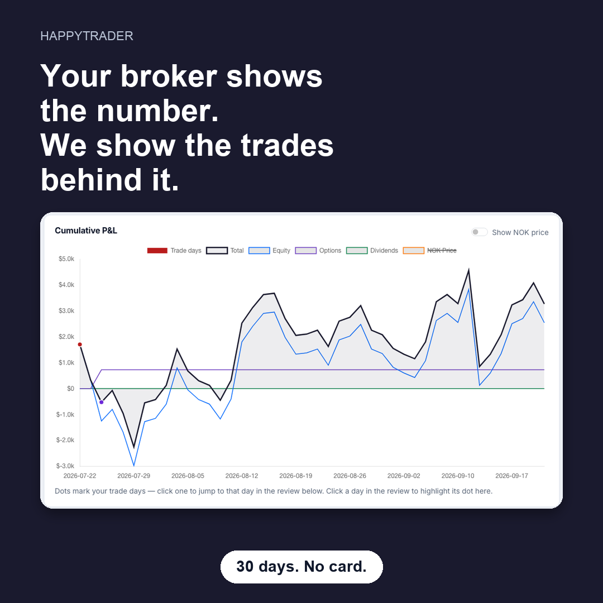
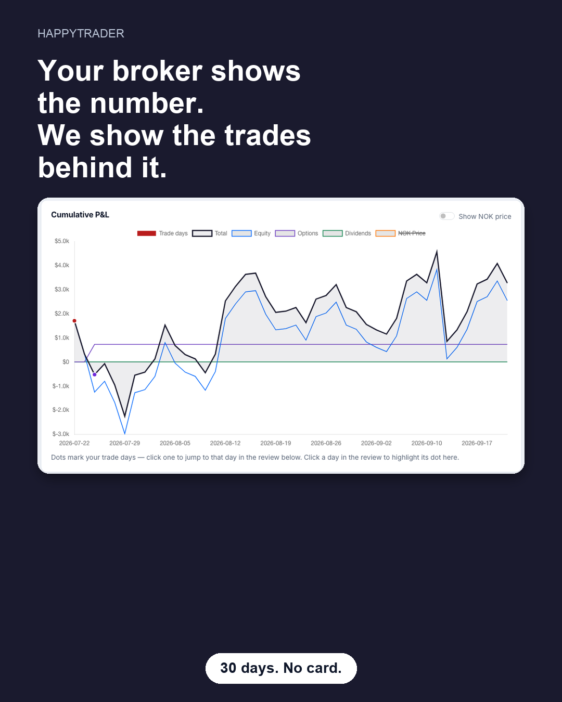
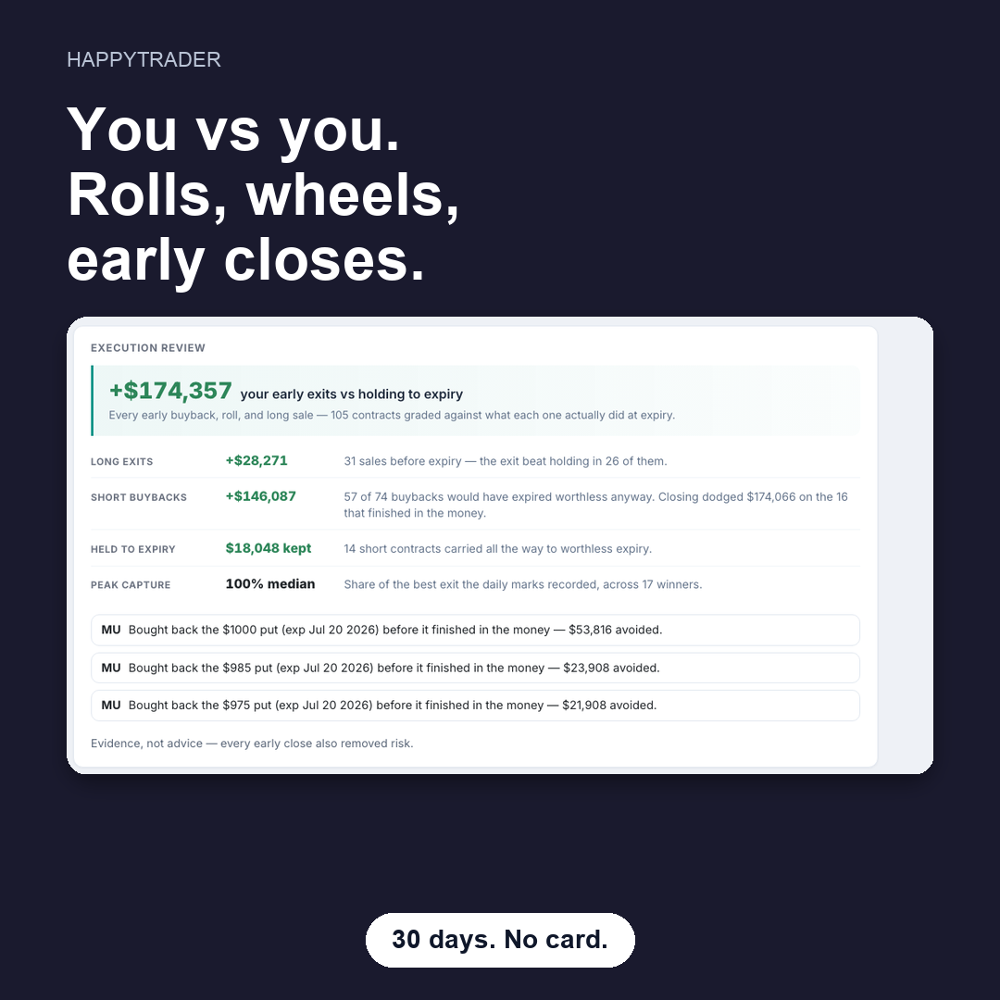
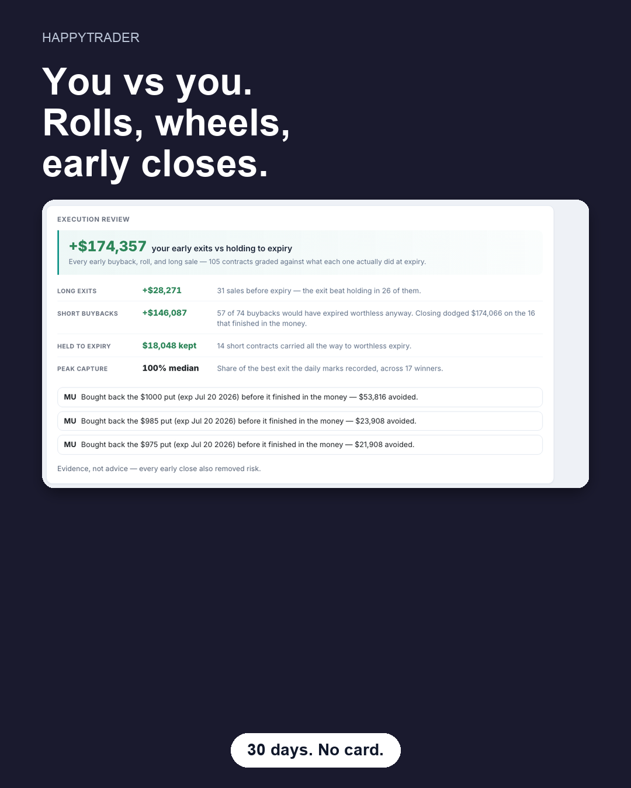
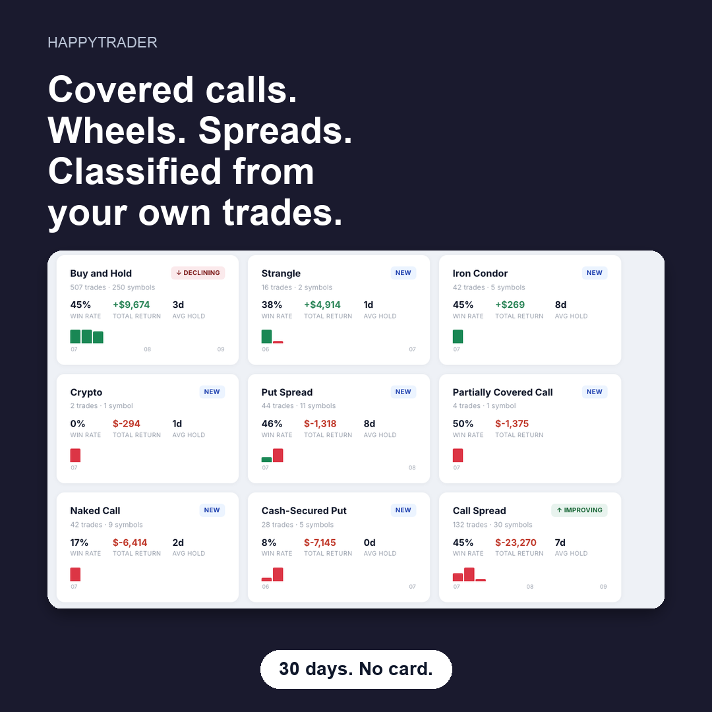
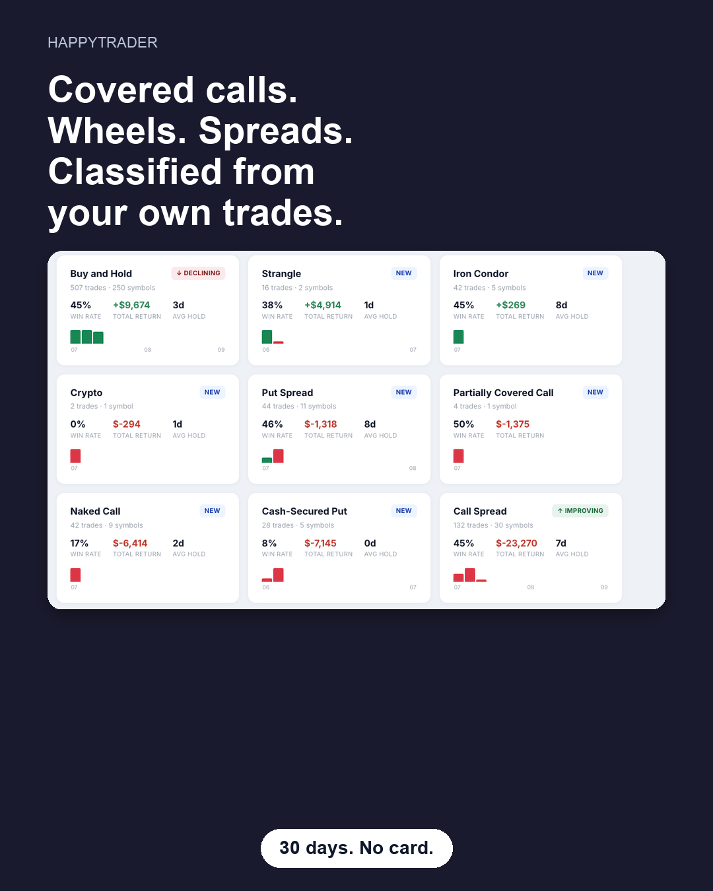

# Reddit ads — mirror-v1

Ads Manager is not created from this repo. The destination, the three
creatives, and the measurement are.

Signup must be open. If `SIGNUP_INVITE_CODE` is set in production, `/start`
is a dead end. Leave it empty before spending.

## Destination

```
https://<prod>/start?utm_source=reddit&utm_campaign=mirror-v1&utm_content=<creative>
```

`<creative>` is `score`, `you`, or `book`. That value is the creative column
on Admin → Overview.

Optional: set `REDDIT_PIXEL_ID` (Ads Manager pixel id) on the web service.
`/start` fires PageVisit. The page after signup fires SignUp. The admin
funnel is the source of truth when the pixel is blocked.

## Who

One campaign, two ad groups.

**Options communities** (start here): r/thetagang, r/options, r/Optionswheel, r/CoveredCalls.

**Broker communities** (second group, after the first is spending): r/Schwab, r/fidelityinvestments.

Do not run r/wallstreetbets or r/investing.

## Creatives

Square (1080×1080) and 4:5 (1080×1350). Files live in `app/static/campaign/ads/`.
New creatives should follow `docs/VISUAL_BRAND.md`: Public Sans, flat navy `#1a1a2e`, copper `#b87333`. Not Inter, and not a purple or night-sky gradient.

### score

Your broker shows the number. We show the trades behind it. 30 days. No card.





### you

You vs you. Rolls, wheels, early closes. 30 days. No card.





### book

Covered calls. Wheels. Spreads. Classified from your own trades. 30 days. No card.





The landing page says the same thing the ad says. 30 days, no card. The clock
starts when the first sync or CSV lands. History is whatever the broker still
has on file, often a year or two, plus a CSV for older trades. Do not write
"5 years" or "free" without "30 days, no card." No return claims. No trade ideas.

## Money

$30/day for 14 days. Three creatives in one ad group so Reddit can spend
toward the winner.

- Turn a creative off after about $50 with zero signups.
- Keep a creative only if landing → signup is at least about 8% and signup →
  connected within 48 hours is at least about 40%.
- Do not raise the budget until that connect rate holds for a week.

Connected, on the admin funnel, is a signup who linked a broker or uploaded
a CSV. A signup that never links is not a win. The same card lists which
button was clicked (hero, the trades, the chart, the review, the profile,
strategy fit, close). A click counts once per landing.
