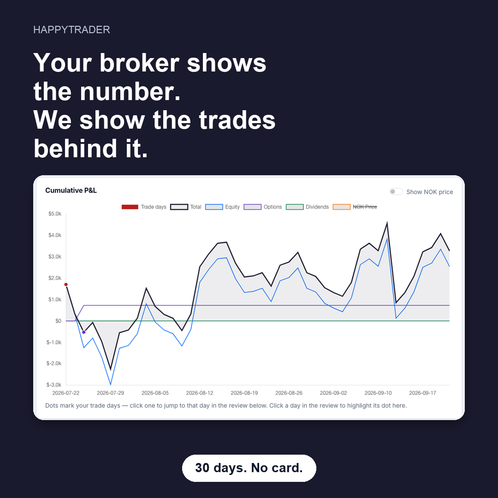
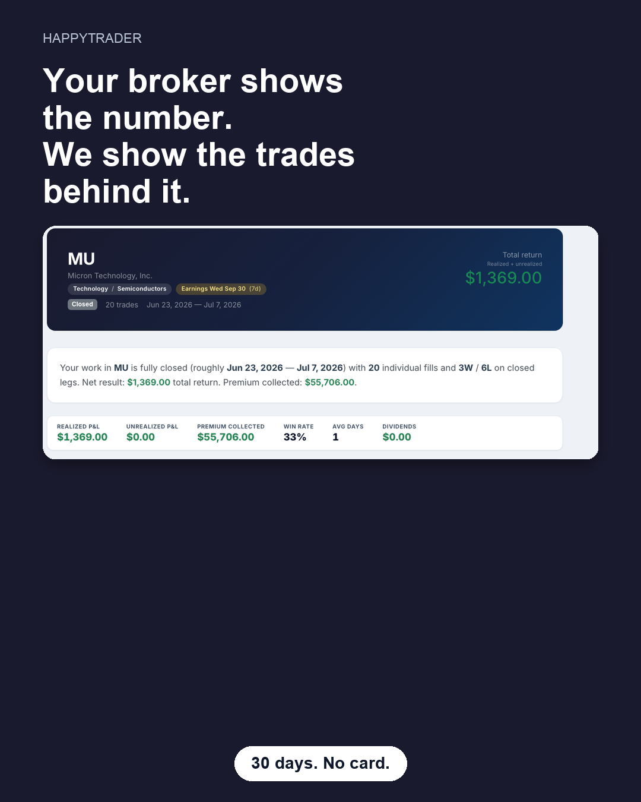
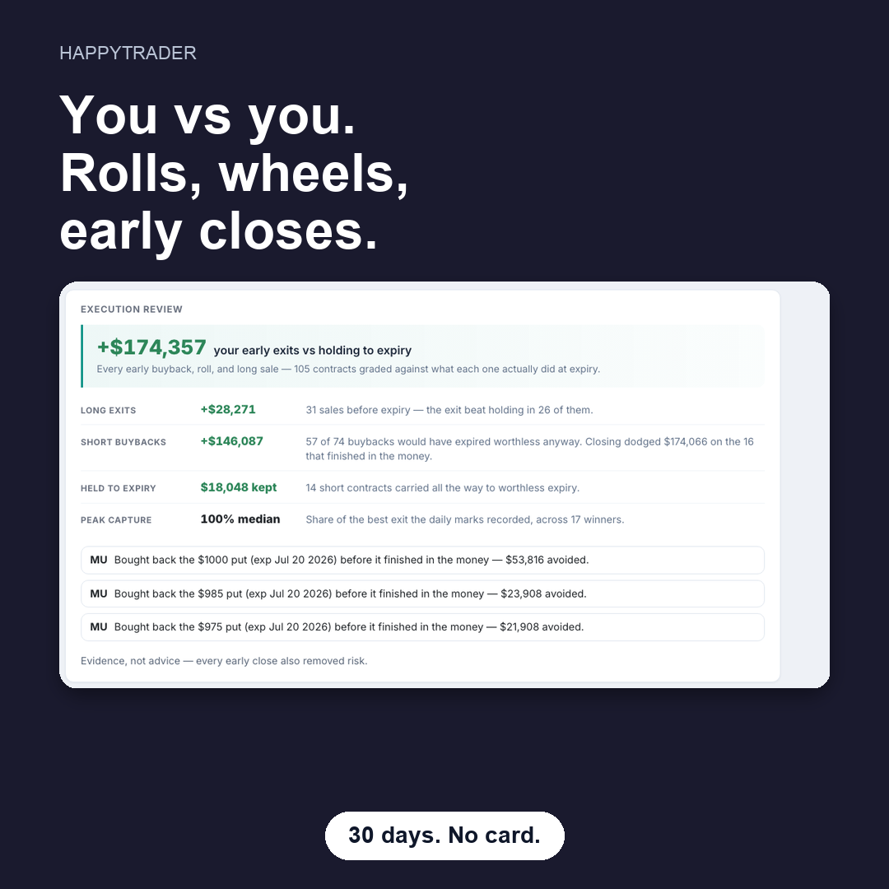
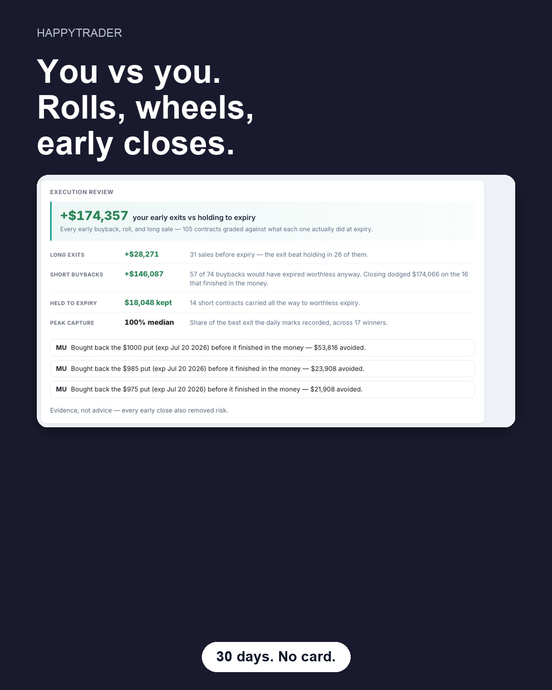
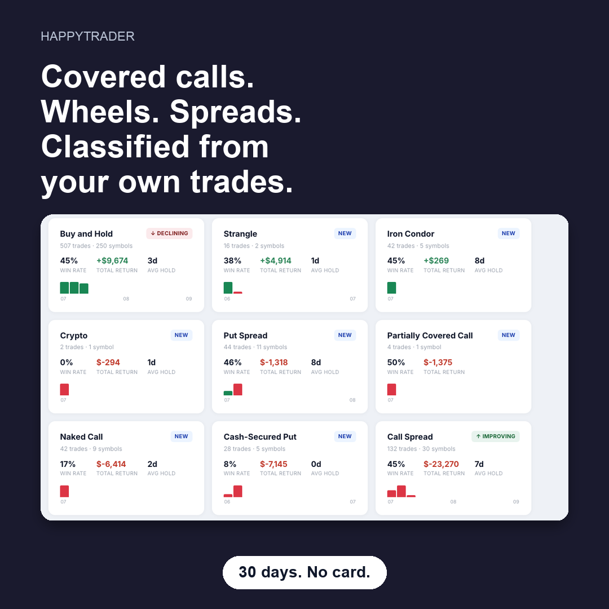
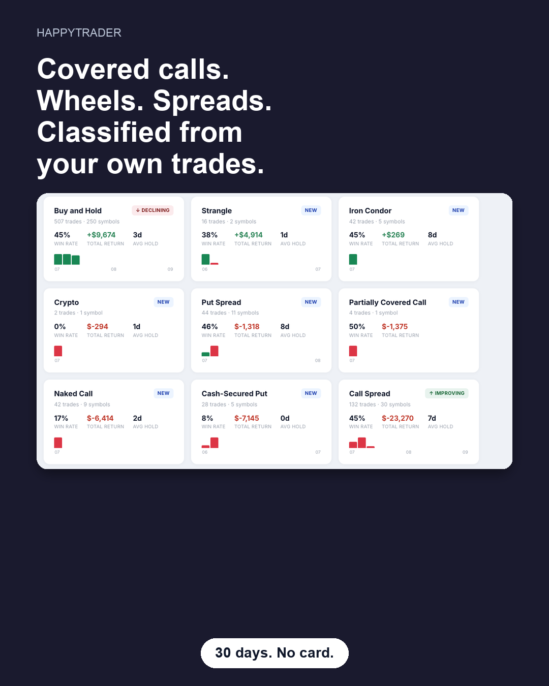

# Reddit ads — mirror-v1

Ads Manager is not created from this repo. The destination, the three
creatives, and the measurement are.

Signup must be open. If `SIGNUP_INVITE_CODE` is set in production, `/start`
is a dead end. Leave it empty before spending.

## Destination

```
https://<prod>/start?utm_source=reddit&utm_campaign=mirror-v1&utm_content=<creative>
```

`<creative>` is `score`, `you`, or `book`. That value is the creative column
on Admin → Overview.

Optional: set `REDDIT_PIXEL_ID` (Ads Manager pixel id) on the web service.
Public pages fire PageVisit. The page after signup fires SignUp. The first
paper account or real brokerage fires Lead. A new Pro payment fires Purchase.
`REDDIT_CAPI_TOKEN` posts the same events to Conversions API v3
(`POST /api/v3/pixels/{pixel}/conversion_events`). `metadata.conversion_id`
is the pixel `conversionId`, and the tracking type is `PAGE_VISIT`,
`SIGN_UP`, `LEAD`, or `PURCHASE`. Both stay off when the env var is empty,
and both stay off when the browser sends Do Not Track or Global Privacy
Control.

First-party counts live at Admin → Acquisition (`/admin/analytics`):
logged-out visitors and page views, the campaign funnel, where they
came from (utm source and campaign, otherwise the referrer host,
otherwise Direct), utm_source / utm_campaign / utm_content, device, and
referrers (YouTube and Reddit stay on the list). Bots, headless
browsers, unsigned JavaScript beacons, and internal traffic (admins,
testingcameron, `INTERNAL_IPS`, `?ht_internal=1`) are left out, and the
page shows how many were filtered. The window is today, 7 days, or 30
days. That page is the source of truth when the pixel is blocked. The
older Admin → Overview card is still the `/start` button funnel.

## Message tests

One focused page per message. `utm_content` is the ad variant. `v` is
the headline variant and is stored on the funnel row and on the user
at signup, next to the UTMs and `rdt_cid`.

```
https://happytrader.me/go/learn?utm_source=reddit&utm_medium=paid&utm_campaign=learn&utm_content=control
https://happytrader.me/go/learn?utm_source=reddit&utm_medium=paid&utm_campaign=learn&utm_content=past&v=past
https://happytrader.me/go/learn?utm_source=reddit&utm_medium=paid&utm_campaign=learn&utm_content=free&v=free

https://happytrader.me/go/real-pnl?utm_source=reddit&utm_medium=paid&utm_campaign=real-pnl&utm_content=control
https://happytrader.me/go/real-pnl?utm_source=reddit&utm_medium=paid&utm_campaign=real-pnl&utm_content=rolls&v=rolls
https://happytrader.me/go/real-pnl?utm_source=reddit&utm_medium=paid&utm_campaign=real-pnl&utm_content=runs&v=runs

https://happytrader.me/go/mistakes?utm_source=reddit&utm_medium=paid&utm_campaign=mistakes&utm_content=control
https://happytrader.me/go/mistakes?utm_source=reddit&utm_medium=paid&utm_campaign=mistakes&utm_content=early&v=early
https://happytrader.me/go/mistakes?utm_source=reddit&utm_medium=paid&utm_campaign=mistakes&utm_content=premium&v=premium
```

`control` keeps the default headline. Learn: "Free options lessons, then
paper trading." Real P&L: "See your real P&L across every broker."
Mistakes: "See which early closes cost you" (the subhead is the BE
−$2,357 buyback). `past` and `free` are the learn headline variants.
`rolls` and `runs` are the real-P&L variants. `early` and `premium` are
the mistakes variants. Every page's button says "Create free account."

The landing says learning and paper trading are free, and that the 30-day
trial starts when a real brokerage is connected. Ad creative can keep
"30 days. No card."

## Who

One campaign, two ad groups.

**Options communities** (start here): r/thetagang, r/options, r/Optionswheel, r/CoveredCalls.

**Broker communities** (second group, after the first is spending): r/Schwab, r/fidelityinvestments.

Do not run r/wallstreetbets or r/investing.

## Creatives

Square (1080×1080) and 4:5 (1080×1350). Files live in `app/static/campaign/ads/`.
New creatives should follow `docs/VISUAL_BRAND.md`: Public Sans, flat navy `#1a1a2e`, copper `#b87333`. Not Inter, and not a purple or night-sky gradient.

### score

Your broker shows the number. We show the trades behind it. 30 days. No card.





### you

You vs you. Rolls, wheels, early closes. 30 days. No card.





### book

Covered calls. Wheels. Spreads. Classified from your own trades. 30 days. No card.





The landing page says learning and paper trading are free, and that the
30-day trial starts when a real brokerage is connected. No credit card.
The clock starts when the first sync or CSV lands. History is whatever the
broker still has on file, often a year or two, plus a CSV for older trades.
Do not write "5 years" in an ad, or "free" without "30 days, no card."
No return claims. No trade ideas.

## Money

$30/day for 14 days. Three creatives in one ad group so Reddit can spend
toward the winner.

- Turn a creative off after about $50 with zero signups.
- Keep a creative only if landing → signup is at least about 8% and signup →
  connected within 48 hours is at least about 40%.
- Do not raise the budget until that connect rate holds for a week.

Connected, on the admin funnel, is a signup who linked a broker or uploaded
a CSV. A signup that never links is not a win. The same card lists which
button was clicked (hero, the trades, the chart, the review, the profile,
strategy fit, close). A click counts once per landing.

## Render env vars for this launch

Set on the `ccwj` web service. Leave a var unset to keep that feature off.

- `REDDIT_PIXEL_ID` — Ads Manager pixel id
- `REDDIT_CAPI_TOKEN` — Conversions API access token
- `REDDIT_CAPI_TEST_ID` — optional. The id from Ads Manager → Event testing.
  When set, every v3 CAPI body includes `data.test_id` (next to `events`)
  so those events show on Reddit's Event testing page. When unset, the
  field is omitted. Remove it after testing — Reddit says to take
  `test_id` off before production, or live events stay in the test tool.
- `SENTRY_DSN` — already supported; errors only
- `SENTRY_TRACES_SAMPLE_RATE` — optional, default `0.1`
- `SIGNUP_INVITE_CODE` — must be empty or `/start` cannot create accounts
- `RATELIMIT_STORAGE_URI` or `QUERY_CACHE_REDIS_URL` — shared rate-limit
  counters. Without Redis, each Gunicorn worker counts separately.

## Load (report only — no plan change in this repo)

The web service is not in `app/render.yaml`. The documented start command
is one sync Gunicorn worker:

`gunicorn wsgi:app -b 0.0.0.0:$PORT --timeout 120 --graceful-timeout 30`

In-process comments describe a 2×4 gthread setup on Render. Confirm the
dashboard start command. For a paid burst, a Starter instance with
`--workers 2 --threads 4` (or Render's default worker formula on Standard)
keeps a slow BigQuery page from blocking `/`, `/start`, `/learn`, and
`/signup`. Those public pages do not query BigQuery.

Postgres opens one connection per query and closes it. There is no app
pool. Landing and signup reads are a single insert into `funnel_events`
plus the user row on POST. Render Postgres free/basic `max_connections`
(usually 97) is enough until the web workers times concurrent authed
BigQuery pages also hold a connection. Move Postgres off the free instance
before spending if it is still there. Do not add a client pool back; the
old one wedged behind Render's idle TCP timeouts.

Rate limits: public GET `/`, `/start`, `/go/*`, `/pricing`, `/signup`, `/learn`,
and `/faq` are outside the 300/hour default so one carrier NAT is not
429'd for reading. `/start` itself allows 120/minute. The hero click
redirect allows 60/minute. Signup POST allows 10/minute and 120/hour per
IP. A script still hits a ceiling. A shared mobile NAT can finish the form.
`/demo/start` allows 10 new sessions per IP per day. The same browser
cookie resumes the open demo and does not count again. Turnstile and the
demo's 150-page / 20-per-minute caps stay. Over the daily cap, the page
offers an account instead of a bare "Slow down".
